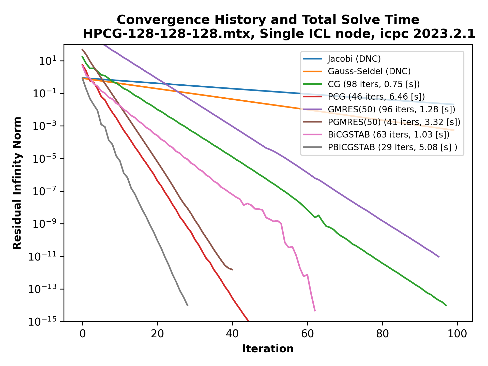
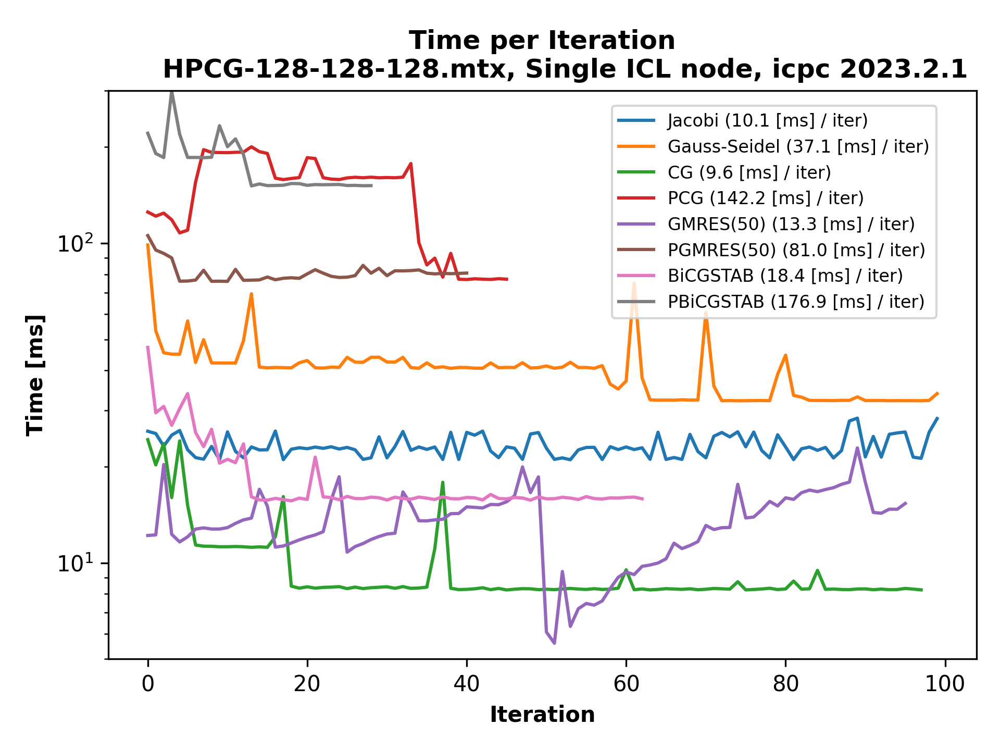

  
  

This is a basic set of (preconditioned) iterative solvers for `x` in `Ax = b`, where `A` is typically assumed to be a large sparse matrix. The format of `A` is CRS, and only left-preconditioning is implemented. This code is mainly for performance investigations.

### Examples ###
* `./basic_iterative_solvers HPCG-128.mtx -cg`
* `./basic_iterative_solvers HPCG-128.mtx -cg -p sgs`
* `./basic_iterative_solvers Anderson,Lx=100,Ly=100,Lz=50,ranpot=5.0 -gm`

### Building basic_iterative_solvers ###
* `git clone git@github.com:DanecLacey/basic_iterative_solvers.git`
* `cd basic_iterative_solvers && make`
* All user-defined solver parameters and configuration options can be found in `config.mk`

### Supported Solvers ###
* Jacobi `-j`
* Gauss-Seidel `-gs`
* (Preconditioned) Conjugate-Gradient `-cg`
* (Preconditioned) (Restarted) GMRES `-gm`
* (Preconditioned) BiCGSTAB `-bi`

### Supported Preconditioners ###
* Jacobi `-p j`
* (Forward/Backward/Symmetric) Gauss-Seidel `-p (gs/bgs/sgs)`

### Features ###
* Stacked timers around key code regions
* Optional code instrumentation with `likwid` markers for collecting hardware performance counters already built-in (https://github.com/RRZE-HPC/likwid)
* Matrices can be read from `.mtx` files, or matrices can be generated with `SCAMAC` library (https://alvbit.bitbucket.io/scamac_docs/index.html) 
