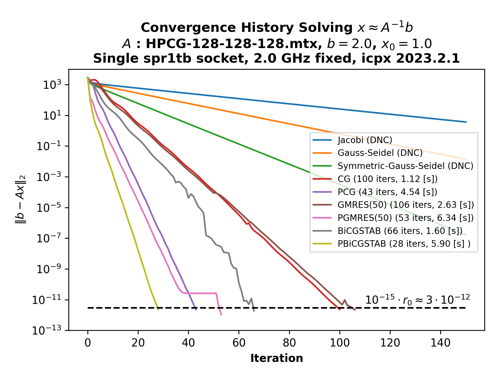
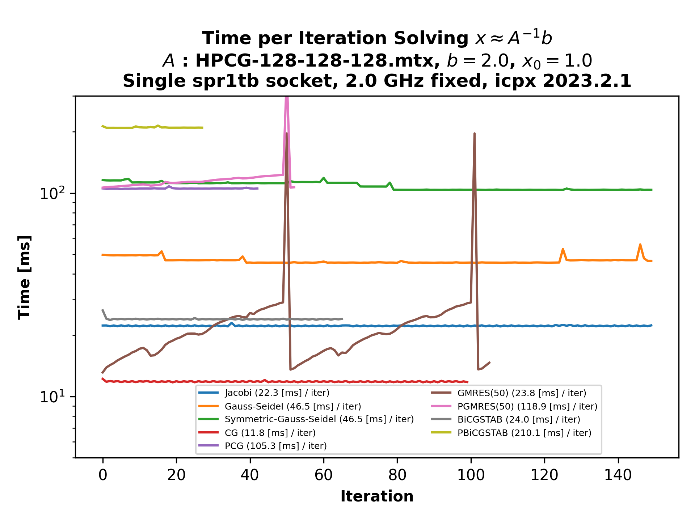

# basic_iterative_solvers #

<p align="center">
  
  
</p>


This is a set of (preconditioned) iterative solvers for `Ax = b`, where `A` is typically assumed to be a large sparse matrix.

### Usage Examples ###
```bash
./basic_iterative_solvers HPCG-128.mtx -cg
```
```bash
./basic_iterative_solvers Anderson,Lx=100,Ly=100,Lz=50,ranpot=5.0 -gm -p gs
```

### Building basic_iterative_solvers ###
``` bash
git clone git@github.com:DanecLacey/basic_iterative_solvers.git
cd basic_iterative_solvers
make
```
* **All user-defined solver parameters and configuration options can be found in `config.mk`**

### Features ###
* Stacked timers around key code regions
* Optional code instrumentation with [likwid](https://github.com/RRZE-HPC/likwid) markers for collecting hardware performance counters already built-in
* Matrices can be read from `.mtx` files, or generated with `SCAMAC` [library](https://alvbit.bitbucket.io/scamac_docs/index.html) 
* Kernel-specific benchmarking found in `benchmarks/`
  * To use, simply `cd benchmarks` and `make && ./run_benchmarks <your_matrix>`
  * Users can toggle performance and accuracy validation against [Intel MKL](https://www.intel.com/content/www/us/en/developer/tools/oneapi/onemkl.html) with `BENCH_MKL` found in `benchmarks/Makefile`

### Supported Solvers ###
* **Richardson** `-r`
* **Jacobi** `-j`
* (Forward/Symmetric)**Gauss-Seidel** `-gs / -sgs`
* (Preconditioned) **Conjugate-Gradient** `-cg`
* (Preconditioned) (Restarted) **GMRES** `-gm`
* (Preconditioned) **BiCGSTAB** `-bi`

### Supported Preconditioners ###
* **Jacobi** `-p j`
* (Forward/Backward/Symmetric/FFBB) **Gauss-Seidel** `-p (gs/bgs/sgs/ffbbgs)`

### Notes ###
* The sparse matrix storage format of `A` is **CRS**.
* Only **left-preconditioning** is implemented.
* This code is mainly for **performance investigations**.